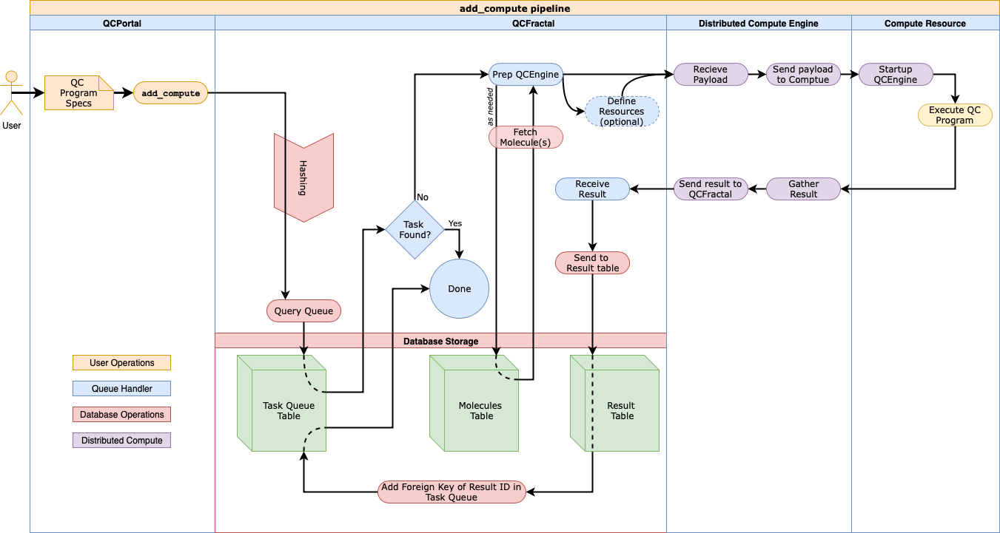
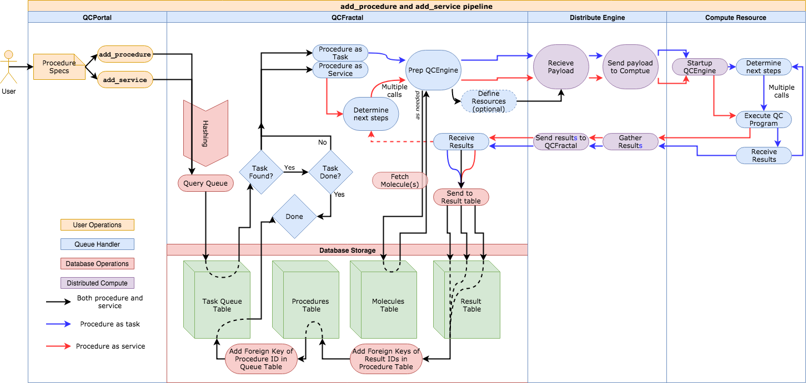

Fractal Call Flowcharts
=======================

The interface between the Portal client, the Fractal server, and the distributed
compute resources is not something easily conveyed by text. We have created
flowchart diagrams to help explain what happens from the time Portal invokes a
call to Fractal, to the time that Fractal finishes handling the request.
These diagrams are simplified to not show every routine and middleware
call, but instead to provide a visual aid to what is happening to help
understanding.

.. _flowchart_add_compute:

``add_compute``
---------------

This flowchart follows the logic behind a user's call to add a compute action
to fractal and any attached distributed compute system.

.. _flowchart_add_procedure:

``add_procedure`` or ``add_service``
------------------------------------

When a user calls ``add_procedure`` or ``add_service``, much of the same
logic is called. The major difference is which side of the distributed
compute engine the logic of the subsequent procedural calls are handled,
on the compute side, or the Fractal side.

This flowchart shows both ends and provides a different path
for each call show by the different colored connecting arrows.

