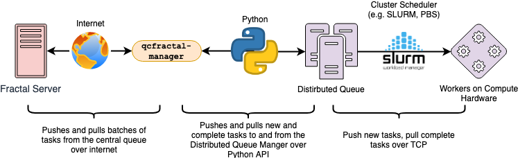

Fractal Queue Managers
======================

Queue Managers are the processes which interface with the Fractal :term:`Server` and
clusters, supercomputers, and cloud resources to execute the tasks in the
Fractal :term:`Server`. These managers pull compute :term:`tasks<Task>` from the
:term:`Server`, and then pass them to various distributed back ends for computation
for a variety of different needs. The architecture of the Fractal :term:`Server`
allows many managers to be created in multiple physical locations. Currently,
Fractal supports the following:

- `Pool` - A python `ProcessPoolExecutor` for computing tasks on a single machine (or node).
- `Dask <http://dask.pydata.org/en/latest/docs.html>`_ - A graph-based workflow engine for laptops and small clusters.
- `Parsl <http://parsl-project.org>`_ - High-performance workflows.
- `Fireworks <https://materialsproject.github.io/fireworks/>`_ - An asynchronous Mongo-based distributed queuing system.

These backends allow Fractal to be incredibly elastic in utilizing
computational resources, scaling from a single laptop to thousands of nodes on
physically separate hardware. Our end goal is to be able to setup a manager at
a physical site and allow it to scale up and down as its task queue requires
and execute compute over long periods of time (months) without intervention.

The basic setup of the Queue :term:`Managers <Manager>` and how they interact with the :term:`Server` is as follows:

.. image:: media/QCQuManagerBasic.png
   :width: 400px
   :alt: Multiple Managers communicating with one server
   :align: right

In this, multiple :term:`managers <Manager>` talk to a central :term:`Fractal Server<Server>` and deploy
:term:`tasks<Task>` to different compute resources based on availability, physical location, and :term:`tags<Tag>`.

The main goals of the Queue :term:`Manager` is to reduce the user's level of expertise needed to start compute with
Fractal and, more importantly, to need as little manual intervention as possible to have persistent compute. Ideally,
you start the :term:`Manager` in a background process, leave it be while it checks in with the
:term:`Fractal Server<Server>` from time to time
to get :term:`tasks<Task>`, and pushes/pulls :term:`tasks<Task>` from the distributed :term:`Adapter` as need be.

The communication between each of the layers involved, and the mechanism by which they communicate is summarized in
this image:

The different levels of communication are all established automatically once the user configures the manager, and
this image shows how information flow from point-to-point.

The manager itself is a fairly lightweight process and consumes very little CPU power on its own. You should talk with
your sysadmin before running this on a head node, but the Queue :term:`Manager` itself will consume
less than 1% CPU we have found and virtually no RAM.

If you are interested in the more detailed workings of the :term:`Manager`, please see the :doc:`managers_detailed`
page. However, the information on that page is not required to set up and run a :term:`Manager`.

Queue Manager Quick Starts
--------------------------

For those who just want to get up and going, consider the following examples.

Laptop/Desktop Quick Boot
+++++++++++++++++++++++++

To get a Manager set up with defaults, running on local hardware, consuming local CPU and RAM, targeting a
Fractal Server running locally, run the following:

.. code-block:: bash

    $ qcfractal-manager

.. _manager_starter_example:

SLURM Cluster, Dask Adapter
+++++++++++++++++++++++++++

To start a manager with a dask :term:`Adapter`, on a SLURM cluster, consuming 1 CPU and 8 GB of ram, targeting a Fractal
Server running on that cluster, and using the SLURM partition ``default``, save the following YAML config file:

.. code-block:: yaml

    common:
     adapter: dask
     tasks_per_worker: 1
     cores_per_worker: 1
     memory_per_worker: 8

    cluster:
     scheduler: slurm

    dask:
     queue: default

and then run the following command:

.. code-block:: bash

    $ qcfractal-manager --config-file="path/to/config.yaml"

replacing the ``config-file`` arg with the path to the file you saved. You will need ``dask`` and ``dask-jobqueue``
(|DaskD|_, |DaskJQ|_), to run this example, which are not packages required by Fractal unless you are running compute
managers; if you use a different :term:`Adapter`, you would need a separate set of packages.

Queue Manager CLI
-----------------

The CLI for the Fractal Queue Manager acts as an **option-specific** overwrite of the YAML file for various
options and therefore its flags can be set in tandem with the YAML. However, it does not have as extensive control as
the YAML file and so complex Managers (like those running Dask and Parsl) need to be setup in YAML.

In case this ever falls out of date, you can always run ``qcfractal-manager --help`` to get the most up-to-date
help block.

.. code-block::

    $ qcfractal-manager --help

    usage: qcfractal-manager [-h] [--config-file CONFIG_FILE] [--adapter ADAPTER]
                             [--tasks_per_worker TASKS_PER_WORKER]
                             [--cores-per-worker CORES_PER_WORKER]
                             [--memory-per-worker MEMORY_PER_WORKER]
                             [--scratch-directory SCRATCH_DIRECTORY] [-v]
                             [--fractal-uri FRACTAL_URI] [-u USERNAME]
                             [-p PASSWORD] [--verify VERIFY]
                             [--manager-name MANAGER_NAME] [--queue-tag QUEUE_TAG]
                             [--log-file-prefix LOG_FILE_PREFIX]
                             [--update-frequency UPDATE_FREQUENCY]
                             [--max-queued-tasks MAX_QUEUED_TASKS] [--test]
                             [--ntests NTESTS] [--schema]

    A CLI for a QCFractal QueueManager with a ProcessPoolExecutor, Dask, or Parsl
    backend. The Dask and Parsl backends *requires* a config file due to the
    complexity of its setup. If a config file is specified, the remaining options
    serve as CLI overwrites of the config.

    optional arguments:
      -h, --help            show this help message and exit
      --config-file CONFIG_FILE

    Common Adapter Settings:
      --adapter ADAPTER     The backend adapter to use, currently only {'dask',
                            'parsl', 'pool'} are valid.
      --tasks_per_worker TASKS_PER_WORKER
                            The number of simultaneous tasks for the executor to
                            run, resources will be divided evenly.
      --cores-per-worker CORES_PER_WORKER
                            The number of process for each executor's Workers
      --memory-per-worker MEMORY_PER_WORKER
                            The total amount of memory on the system in GB
      --scratch-directory SCRATCH_DIRECTORY
                            Scratch directory location
      -v, --verbose         Increase verbosity of the logger.

    FractalServer connection settings:
      --fractal-uri FRACTAL_URI
                            FractalServer location to pull from
      -u USERNAME, --username USERNAME
                            FractalServer username
      -p PASSWORD, --password PASSWORD
                            FractalServer password
      --verify VERIFY       Do verify the SSL certificate, leave off (unset) for
                            servers with custom SSL certificates.

    QueueManager settings:
      --manager-name MANAGER_NAME
                            The name of the manager to start
      --queue-tag QUEUE_TAG
                            The queue tag to pull from
      --log-file-prefix LOG_FILE_PREFIX
                            The path prefix of the logfile to write to.
      --update-frequency UPDATE_FREQUENCY
                            The frequency in seconds to check for complete tasks.
      --max-queued-tasks MAX_QUEUED_TASKS
                            Maximum number of tasks to hold at any given time.
                            Generally should not be set.

    Optional Settings:
      --test                Boot and run a short test suite to validate setup
      --ntests NTESTS       How many tests per found program to run, does nothing
                            without --test set
      --schema              Display the current Schema (Pydantic) for the YAML
                            config file and exit. This will always show the most
                            up-to-date schema. It will be presented in a JSON-like
                            format.

.. _manager_glossary:

Terminology
-----------

There are a number of terms which can overlap due to the layers of abstraction and the type of software and hardware
the Queue Manager interacts with. To help with that, the pages in this section will use the terminology defined below.
Several pieces of software we interface with may have their own terms or the same term with different meaning, but
because one goal of the Manager is to abstract those concepts away as best it can, we choose the following set. If
you find something inappropriately labeled, unclear, or overloaded in any way, please raise an issue
`on GitHub <https://github.com/MolSSI/QCFractal/issues/new/choose>`_ and help us make it better!

An important note: Not all the concepts/mechanics of the :term:`Manager` and :term:`Adapter` are covered in the
glossary by design!
There are several abstraction layers and mechanics which the user should never have to interact with or even be aware
of. However, if you feel something is missing, let us know!

.. glossary::
    :sorted:

    Manager
        The :doc:`Fractal Queue Manager<managers>`. The term "Manager" presented by itself refers to this object.

    Adapter
        The specific piece of software which accepts :term:`tasks<Task>` from the :term:`Manager` and sends them to the
        physical hardware. It is also the software which typically interacts with a cluster's :term:`Scheduler` to
        allocate said hardware and start :term:`Job`.

    Distributed Compute Engine
        A more precise, although longer-winded, term for the :term:`Adapter`.

    Scheduler
        The software running on a cluster which users request hardware from to run computational :term:`tasks<Task>`,
        e.g. PBS, SLURM,
        LSF, SGE, etc. This, by itself, does not have any concept of the :term:`Manager` or even the :term:`Adapter`
        as both interface with *it*, not the other way around. Individual users' clusters may, and almost always,
        have a different configuration, even amongst the same governing software. Therefore, no two Schedulers
        should be treated the same. In many cases, the :term:`Adapter` submits a :term:`Job` to the Scheduler with
        instructions of how the :term:`Job` should start a :term:`Worker` once it is allocated and booted.

    Job
        The specific allocation of resources (CPU, Memory, wall clock, etc) provided by the :term:`Scheduler` to the
        :term:`Adapter`. This is identical to if you requested batch-like job on a cluster (e.g. though ``qsub`` or
        ``sbatch``), however, it is more apt to think of the resources allocated in this way as "resources to be
        distributed to the :term:`Task` by the :term:`Adapter`". Although a user running a :term:`Manager` will likely
        not directly interact with these, its important to track as these are what your :term:`Scheduler` is actually
        running and your allocations will be charged by. At least (and usually only) one :term:`Worker` will be
        deployed to a :term:`Job` from the :term:`Adapter` to handle incoming :term:`Task`\s. Once the :term:`Worker`
        lands, it will report back to the :term:`Adapter` and all communications happen between those two objects; the
        Job simply runs until either the :term:`Adapter` stops it, or the :term:`Scheduler` ends it.

    Task
        A single unit of compute as defined by the Fractal :term:`Server` (i.e. the item which comes from the Task
        Queue). These tasks are preserved as they pass to the distributed compute engine and are what are presented to
        each distributed compute engine's :term:`Worker`\s to compute

    Worker
        The process executed from the :term:`Adapter` on the allocated hardware inside a :term:`Job`. This process
        receives the :term:`tasks<Task>` tracked by the :term:`Adapter` and is responsible for their execution. The
        Worker itself is responsible for consuming the resources of the :term:`Job` and distributing them to handle
        concurrent :term:`tasks<Task>`. In most cases, there will be 1 Worker per :term:`Job`, but there are some
        uncommon instances where this isn't true. You can safely assume the 1 Worker/:term:`Job` case for Fractal
        usage. Resources allocated for the Worker will be distributed by the :term:`Adapter`\s configuration,
        but is usually uniform.

    Server
        The Fractal Server that the :term:`Manager` connects to. This is the source of the
        :term:`Task`\s which are pulled from and pushed to. Only the :term:`Manager` has any notion
        of the Server of all the other software involved with the :term:`Manager` does not.

    Tag
        Arbitrary categorization labels that different :term:`tasks<Task>` can be assigned when submitted to the
        :term:`Server`. :term:`Managers<Manager>` can pull these tags if configured, and will *exclusively* pull their
        defined tag if so. Similarly, :term:`tasks<Task>` set with a given tag can *only* be pulled if
        their :term:`Manager` is configured to do so.
