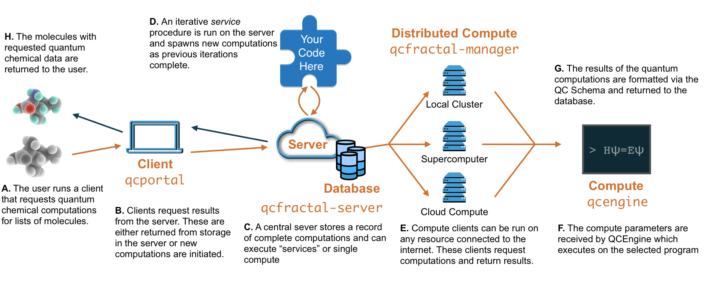

.. QCFractal documentation master file, created by
   sphinx-quickstart on Fri Aug 17 09:45:43 2018.
   You can adapt this file completely to your liking, but it should at least
   contain the root `toctree` directive.

=========
QCFractal
=========

*A platform to compute, store, organize, and share large-scale quantum chemistry data.*

QCFractal emphasizes the following virtues:

- **Organize:** Large sets of computations are organized into Collections for easy reference and manipulation.
- **Reproducibility:** All steps of commonly used pipelines are elucidated in the input without additional human intervention.
- **History:** Organize all computations ever executed in a research group in an easily indexable manner, never lose data again!
- **Accessibility:** Easily share quantum chemistry data with colleagues or the community through accessibility settings.
- **Elasticity:** Scale from a single laptop to a dozen simultaneous supercomputers.
- **Transferability:** Run many different quantum chemistry, semiempirical, or force field programs with a single unified interface.

QCFratal within the QCArchive stack
-----------------------------------

Within the QCArchive stack, QCFractal is responsible for:

- Accepting requests for calculations, submitted from a client such as `QCPortal <http://docs.qcarchive.molssi.org/projects/qcportal/en/latest/>`_.
- Running these calculations on disparate compute resources through Quantum Chemistry programs and procedures supported by `QCEngine <http://docs.qcarchive.molssi.org/projects/qcengine/en/latest/>`_.
- Storing and organizing the results of these calculations in a database.
- Providing access to stored results to clients such as `QCPortal <http://docs.qcarchive.molssi.org/projects/qcportal/en/latest/>`_.

The diagram below illustrates a representative data flow:

Pipelines
---------
QCFractal supports several high-throughput pipelines:

- Ensembles of single point quantum chemistry computations.
- Procedures such as geometry optimization, finite different gradients and Hessians, and complete basis set extrapolations.
- Complex scenarios such as the `OpenFF <http://openforcefield.org>`_ torsion scan workflow.
- User-defined procedures.

Data Sharing
------------

QCFractal allows for the creation of a single data repository for a group with
varying permission levels to allow control of who can access your data or
submit new tasks to your compute network. Hook into the central MolSSI
repository or create your own!

Scales from laptops to supercomputers
-------------------------------------

QCFractal is build to be elastic, scaling from a single researcher on a laptop
to large multi-PI groups on dozens of different supercomputers. QCFractal
provides a central location to marshal and distribute data or computation.
QCFractal can switch between a variety of computational queue backends such
as:

- `Parsl <http://parsl-project.org>`_ - High-performance workflows with backend support for common schedulers, supercomputers, and cloud compute.
- `Dask <http://dask.pydata.org/en/latest/docs.html>`_ - A graph-based workflow engine for laptops and small clusters.
- `Fireworks <https://materialsproject.github.io/fireworks/>`_ - A asynchronous Mongo-based distributed queuing system.

Additional backends such as BOINC, RADICAL Pilot, Kubernetes, and Balsam are under active
consideration. :ref:`Contact us <work-with-us>` if you are interested in one of these use-cases.

========

Index
-----

**Getting Started**

* :doc:`install`
* :doc:`quickstart`
* :doc:`setup_quickstart`
* :doc:`setup_server`
* :doc:`setup_compute`

.. toctree::
   :maxdepth: 1
   :hidden:
   :caption: Getting Started

   install.rst
   quickstart.ipynb
   setup_quickstart.rst
   setup_server.rst
   setup_compute.rst

**Records Documentation**

The records created from adding additional compute.

* :doc:`results`
* :doc:`procedures`
* :doc:`services`
* :doc:`flow`

.. toctree::
   :maxdepth: 1
   :hidden:
   :caption: Records Documentation

   results.rst
   procedures.rst
   services.rst
   flow.rst

**Manager Documentation**

Setting up and running Fractal's Queue Managers on your system.

* :doc:`managers`
* :doc:`managers_config_api`
* :doc:`managers_hpc`
* :doc:`managers_samples`
* :doc:`managers_faq`

.. toctree::
   :maxdepth: 1
   :hidden:
   :caption: Manager Documentation

   managers.rst
   managers_config_api.rst
   managers_hpc.rst
   managers_samples.rst
   managers_faq.rst
   managers_detailed.rst

**Server Documentation**

Configuring and running the Server from the CLI and Config Files

* :doc:`server_init`
* :doc:`server_config`
* :doc:`server_start`
* :doc:`server_user`
* :doc:`server_upgrade`

.. toctree::
   :maxdepth: 1
   :hidden:
   :caption: Server CLI and Configuration

   server_init.rst
   server_config.rst
   server_start.rst
   server_user.rst
   server_upgrade.rst
   server_view.rst

**Developer Documentation**

Contains in-depth developer documentation.

* :doc:`qcarchive_overview`
* :doc:`glossary`
* :doc:`changelog`
* :doc:`glossary`

.. toctree::
   :maxdepth: 1
   :hidden:
   :caption: Developer Documentation

   qcarchive_overview.rst
   api.rst
   database_design.rst
   glossary.rst
   dev_guidelines.rst
   changelog.rst
