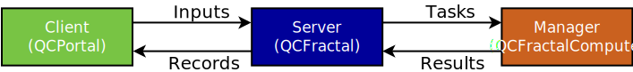

Tasks and Services
==================

Records fall into two different categories - *task-based* and *service-based*.
Task-based records are small, self-contained records that get computed all at once
by manager and returned to the server. After this computation, the record is complete.
An example of this is a :doc:`singlepoint record <../user_guide/records/singlepoint>` - a compute
manager receives the task, runs the singlepoint computation, and returns the result.

A service is a more complex workflow. A portion of the service runs as part of the qcfractal
server (as an :doc:`internal job <internal_jobs>`). This server-side portion
is used to generate other records (either service-based or task-based), and then will wait
for those dependencies to complete before iterating again (and possibly creating more records).
An example of this is an :doc:`nudged elastic band <../user_guide/records/neb>` calculation, where
each iteration of the NEB calculation spawns gradient calculations, which are then analyzed to
determine the next iteration.

Records have an :attr:`~qcportal.record_models.BaseRecord.is_service` property that shows whether or not
this record is service-based.

.. _tasks:

Tasks
--------

Records that are task-based are executed as a unit on a :ref:`compute manager <glossary_manager>`.
These records have a :attr:`~qcportal.record_models.BaseRecord.task` property, which contains all the information
necessary for computation. This data is what is actually sent to the compute manager. Typically, a user does not
need to access this object, but it can be useful for developers and for debugging purposes.

This :class:`~qcportal.record_models.RecordTask` also contains the routing tag and priority.
After successful completion, the associated task is removed from the database.

.. _services:

Services
--------

Services are more complex than tasks, and have an iterative portion that runs on the QCFractal server.
The server is responsible for selecting which services are due for iterating, and code on the server
does the iteration itself. There is typically a limit on the number of running services on a server
(which is configurable).

Like tasks, services are assigned a tag and priority - the priority determines the order that the services start
on the server. Dependencies (new records) created by the services inherit both the tag and priority.

Records that are based on services have a :attr:`~qcportal.record_models.BaseRecord.service` property
(a :class:`~qcportal.record_models.RecordService`), which contains
all the information about the service. Like tasks, it is not commonly needed by users, except for debugging.

Unlike task-based records, service-based records often update their output on the server while running, which can
be viewed with the :attr:`~qcportal.record_models.BaseRecord.stdout` property.

.. _routing_tags:

Routing tags
------------

Routing tags are user-specified strings that assist in routing tasks to particular managers.
Every task is given a single tag when the record is submitted, and managers
are configured with multiple tags.

Managers are configured to claim tasks whose tag matches one given in their configuration.

.. image:: ../graphics/routing_tags.svg
  :align: center

Tags are matched with the following considerations:

* Tasks are first come, first serve. If a manager is able to claim a task, it will do so, even if
  another manager exists that is a better match.

* The order of the tags specified in a manager's configuration determines the priority. If no tasks
  (or not enough tasks) match the first tag, then it will move on to the second tag, and so on.

* A wildcard tag ``*`` in a manager's configuration will allow that manager to pick up any task.

* A wildcard tag ``*`` in a task means that the task will only be claimed by a manager with a
  wildcard tag.

In addition to tags, tasks are only claimed if the required programs are satisfied by the manager.
After selection of tags and programs are satisfied, then managers will claim based on the priority and then
the date the task was created.

.. caution::

  Tasks being claimed on a first-come first serve basis is important to remember when you have
  managers that have the wildcard tag. These managers will pick up anything, even
  if another manager exists that exactly matches a task's tag, if they claim tasks from the
  server first.

Tasks and Services API
----------------------

.. autopydantic_model:: qcportal.record_models.RecordTask

.. autopydantic_model:: qcportal.record_models.RecordService
