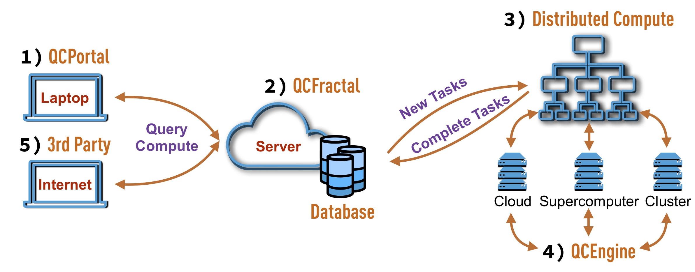

QCArchive Design
==================

The QCArchive software ecosystem consists of a series of Python modules that
can either be used together or are useful standalone pieces to the
computational molecular sciences community. This ecosystem is constructed to
be used at single-user, small group, and multi-PI levels while retaining
the ability to scale up to the needs of an entire community of scientist.

In each case, it is expected only a small number of users are required to
understand the entire software stack and the primary interaction with the
QCArchive ecosystem will be through the user front-end (QCPortal). After the
persistence server instance (QCFractal) is instantiated with a distributed
workflow system and compute the server should be able to maintain
itself without user intervention. A diagram of how the ecosystem works in
concert can be seen below:

1) QCPortal
++++++++++++

- GitHub: |QCPortalBadge|_
- Hardware: Laptop
- Actor: User
- Primary Developer: MolSSI

.. |QCPortalBadge| image:: https://img.shields.io/github/stars/MolSSI/QCPortal.svg?style=social&label=Stars
.. _QCPortalBadge: https://github.com/MolSSI/QCPortal

QCPortal provides a Python-based user front-end experience for users who are
interested in exploring data and executing new tasks. Exploration of computed
data is augmented by the ability to generate graphs quickly and other
representations to view the data in Jupyter notebooks and high-level
abstractions are used to view and manipulate many individual tasks
simultaneously. Querying of data and submission of new tasks occurs over the
QCFractal REST API.

2) QCFractal
++++++++++++

- GitHub: |QCFractalBadge|_
- Hardware: Persistent Server
- Actor: Power User
- Primary Developer: MolSSI

.. |QCFractalBadge| image:: https://img.shields.io/github/stars/MolSSI/QCFractal.svg?style=social&label=Stars
.. _QCFractalBadge: https://github.com/MolSSI/QCFractal

QCFractal is the primary persistent server that QCPortal communicates with and has several main duties:

 - Maintain a database of all completed quantum chemistry results along with metadata that forms higher-level collections of results.
 - Maintain a compute queue of all requested and completed tasks. Where each task is a single quantum chemistry result.
 - Submit new tasks to distributed workflow engines and insert complete results into the database.
 - Maintain high level compute workflows via the "Services" feature.

3) Distributed Compute
++++++++++++++++++++++

 - Hardware: Persistent Server/Supercomputer
 - Actor: Power User
 - Primary Developer: Scientific and HPC Communities

The QCArchive project relies on a number of distributed compute workflow
engines to enable a large variety of compute workloads. QCFractal will
interact with each of these projects by submitting a series of tasks that do
not have data or execution order dependence. The communication interfaces vary
from Python-based API calls to REST API interfaces depending on the
implementation details of the individual tools.

Current distributed compute backends are:

 - `Dask Distributed <http://dask.pydata.org>`_ - Multi-node task graph schedular built in Python.
 - `Fireworks <https://materialsproject.github.io/fireworks/>`_ - Multi-site task schedular built in Python with a central MongoDB server.

Pending backend implementations include:

 - `RADICAL Cybertools <https://radical-cybertools.github.io>`_ - Distributed task scheduler built for DOE and NSF compute resources.
 - `BOINC <http://boinc.berkeley.edu>`_ - High throughput volunteer computing task manager.
 - `Balsam <https://balsam.alcf.anl.gov>`_ - Task manager for a single compute resource (supercomputer) with tasks pulled from a central server.

The compute workers of each of these tools is executed in different ways.
However, in each case the compute workers will distribute QCSchema_ inputs,
call QCEngine, and receive a QCSchema_ output.

4) QCEngine
++++++++++++

- GitHub: |QCEngineBadge|_
- Hardware: Local Cluster, Supercomputer, or Cloud Compute
- Actor: Power User

.. |QCEngineBadge| image:: https://img.shields.io/github/stars/MolSSI/QCEngine.svg?style=social&label=Stars
.. _QCEngineBadge: https://github.com/MolSSI/QCEngine

QCEngine is a stateless, lightweight wrapper around Quantum Chemistry programs
so that these programs consistently accept and emit QCSchema_. Depending on
the underlying program QCEngine provides this uniform interface by either:

 1) Calling the QCSchema_ IO functions that individual program have implemented.
 2) Calling the Python-API of the program and modifying the input/output according to the QCSchema_.
 3) Writing a ASCII input file based on the input QCSchema_, running the program, and parsing an ASCII output file into the QCSchema_.

QCEngine also keeps track of the provenance of each task. This includes:

 - A description of the hardware used (CPU, GPU, memory, etc).
 - The total compute time and resources allocated to the run.
 - The function and version of the program called.

5) 3rd Party Services
+++++++++++++++++++++

 - Hardware: Laptop
 - Actor: User/Power User
 - Primary Developer: Computational Molecular Sciences Community

The QCFractal API is expected to have additional services attached by 3rd
parties. These services can range from cross-reference data services to user
website that visualize and interact with the data in a specific way,

.. _QCSchema: https://github.com/MolSSI/QC_JSON_Schema
