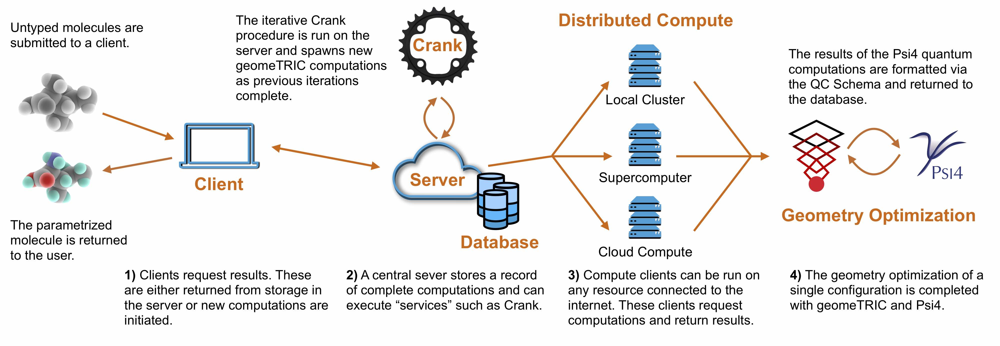

Development Roadmap
===================

Mission Statement
-----------------

The QCArchive project sets out to answer the fundamental question of "How do
we compile, aggregate, query, and share quantum chemistry data to accelerate
the understanding of new method performance, to facilitate the fitting of novel force fields, and
to support the incredible data needs of machine learning for computational
molecular science?"

The QCArchive project is made up of three primary tools:

- `QCSchema <https://github.com/MolSSI/QC_JSON_Schema>`_ - A key/value schema for quantum chemistry.
- `QCEngine <https://github.com/MolSSI/QCEngine>`_ - A computational middleware providing IO to a variety of quantum chemistry programs.
- `QCFractal <https://github.com/MolSSI/QCFractal>`_ - A distributed compute and database platform powered by QCEngine and QCSchema.

The tools aim to provide an environment to facilitate the following goals:

- Assist the computational molecular sciences (CMS) community in becoming more data-driven and statistical in nature.
- Provide community-driven, multi-use quantum chemistry databases that the CMS community can access free of charge.
- Support QC data requirements of the Open Force Field Consortium.
- Support upcoming machine learning initiatives.
- Provide all current major QC databases in a universal format (S22, GMTMKN55).
- Provide container-based programs whereby community members can contribute computational time toward chosen portions of the database.
- Work directly with popular database manipulation front ends to provide their data backend requirements.
- To the extent possible, build tools in reusable pieces that can be reappropriated for general use.

An initial design document can be found `here <https://docs.google.com/document/d/1jG9BGIaDswkm03kiNdAGUE4FUDFGtYp_axV5J-Dg8OM/edit?usp=sharing>`_.

===========

Timeline: 2019-01-15 - Future
-----------------------------

The roadmap is in progress.

===========

Timeline: 2018-08-23 to 2019-01-15
----------------------------------

This roadmap lays out the first six months of development from
the end of 2018 continuing into early 2019. Targets
focus primarily on the initial capabilities of the project and building out
an extensible core.

Use Case: OpenFF Torsion Scans
++++++++++++++++++++++++++++++

Collaborators: `Open Force Field Consortium <http://openforcefield.org>`_

Document: `UC: Torsion Scans <https://docs.google.com/document/d/1OmIeMISfrxBVyVXYYj5jn2eVzaPRbuZbNtRPgenFOrQ/edit?usp=sharing>`_.

The Open Force Field Group Consortium aims to democratize the fitting and
generation of data within the force field community by providing open source
toolkits and open datasets. The QCArchive project supports
the following workflow:

Use Case: Reference Databases
+++++++++++++++++++++++++++++

Collaborators: `Sherrill Group (Georgia Tech) <http://vergil.chemistry.gatech.edu>`_

Document: `UC: Reference Databases <https://docs.google.com/document/d/12_X60PFPZmnj-Ak9AEGW_VytzZ0LtJrAMxZnSFu0aJo/edit?usp=sharing>`_.

Reference datasets form the core of understanding the performance of more
approximate methods in quantum chemistry. These datasets are
growing in size and publication rate, as new ideas and theories
are applied to
increasing chemical diversity requirements.

Reference datasets are often found in an assortment of CSV, PDF, and raw ASCII
files. The diverse formats make harvesting (or even using) these benchmarks
onerous, yet they are fundamental to our understanding of
popular and approximate methods. To our knowledge, aggregating these quantum
chemistry references has only been tried rarely and without to significant
effect. Please examine the `BegDB <http://www.begdb.com>`_ and the `BFDb
<http://vergil.chemistry.gatech.edu/active_bfdb/bfdb/cgi-bin/bfdb.py>`_
projects for current examples.

The QCArchive project will
construct a framework to make the computation and storage of datasets as
painless as possible. These tools can also be used to
distribute reference datasets. Finally, by encoding many data best
practices such as computational provenance and reference tracking,
these datasets enhance
the reproducibility of downstream research.

Release Schedule
++++++++++++++++
To facilitate the rapid evolution of features, a release will be created on
the first of every month. The next five releases will have the following foci:

- **Release 2018-09-01**: Rapid evolution of feature set and overall structure
- **Release 2018-10-01**: Working examples that facilitate use-cases.
- **Release 2018-11-01**: Backend optimization and cleanup.
- **Release 2018-12-01**: Security, database optimization, and documentation.
- **Release 2019-01-15**: Remaining issues for a first release.
